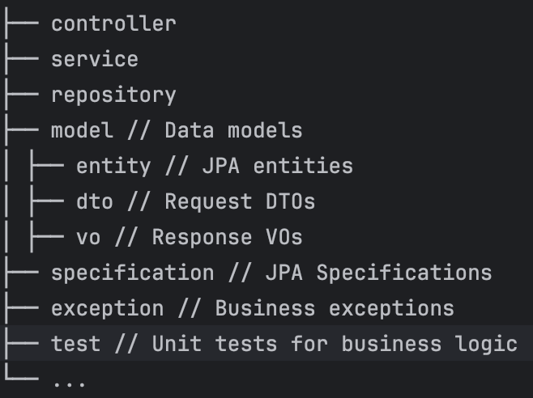

# Gamers Management System

## Overview

This is a backend system developed with **Spring Boot + Spring Data JPA**, designed to manage gamers, games, and levels. It supports creating gamer profiles, binding games to gamers, and searching gamers based on flexible or fixed conditions.

---

## Quick Start

### Clone the repo from
```bash
git clone https://github.com/gengye25/Gamers.git
cd Gamers
```

### Initialize the Database
- sql/gamer_demo.sql : run the script to load the database, I used TablePlus but I think IDEA / Terminal also works?
- src/main/resources/application-dev.yml : datasource
  - *database* - your database name
  - *username* - your username
  - *password* - your password 

### Build with Maven
```bash
mvn clean install
```

### Run the application
```bash
mvn spring-boot:run
```
The service will start on: http://localhost:8080
API Docs: http://localhost:8080/doc.html

### Run tests
```bash
mvn test
```
---

## Core Features

- Create Gamer
- Create Game
- Bind Gamer to Game (with Level)
- Search gamers by any combination of geography, game, and level
- Exception handling & input validation
- Unit tests for service layer logic

---

## API Endpoints
//TODO: requestbody / curl example

**POST /gamer/save** -- Create a new gamer

**POST /game/save** -- Create a new game

**POST /gamer/bind** -- New gamer-game binding

**GET /gamer/search?game=<>&level=<>&geography=<>** -- Search gamers by game, level and geography

**GET /gamer/get_by_game_and_level Get gamers by game and level** -- Get gamers by game and level

---

## Tech Stack

- **Java 17**
- **Spring Boot 3.x**
- **Spring Data JPA**
- **H2 / MySQL**
- **Lombok**
- **JUnit 5 + Mockito**

---

## Project Structure



## Requirements

- JDK 17+
- Maven 3.6+
- MySQL 8+
- I used Knife4j to test APIs, but I think swagger-UI also works?

## Some thoughts

### Database Design


Why *id*-s are the primary keys? - Must be unique (auto-increment), and we don't know if *name*-s can be updated in the future.
### JDBC vs. JPA?

~~Challenge myself~~
Pre-defined methods, compatible with Spring Boot + JUnit

### Why specification?

~~Also Challenge myself~~
Dynamic, consistence with SQL, Easier to debug (with hibernate)

### Why component?

Still not user-friendly (or programmer friendly?) enough to be a service, as it operates user_id and game_id directly, which are not open to external. </br>
A more practical reason: to let *bindByName* call it with `@Transactional`.

### Security studies

There's no direct sql query thanks to JPA, so there's no worries for sql injection. </br>
And for APIs, the *ExceptionHandler* have already prevented invalid inputs, and also shielded original error information, so there won't be crucial information leaking.

## Future plans

- **More standardized/readable naming:** In the project I sometimes use "User" instead of "Gamer", and that's pretty confusing (also in database I used "userID" in the *gamer_game* table). I really should unify them to "User", it's really hard to tell whether it's *gamerServiceImpl* or *gameServiceImpl*. </br> Also "link" and "bind", they are the same operation essentially.
- **Better design for VO (and some DTO):** Pagination, count; List\<VO\> -> VO{... List<sth> ...}?
- **Complete the APIs:** UPDATE, DELETE...
- **Standardize the datasource:** schema.sql + data.sql
- **Apply Redis**
- ...

